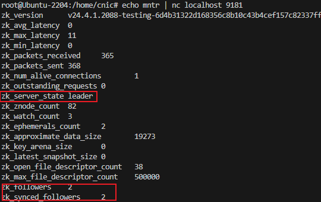
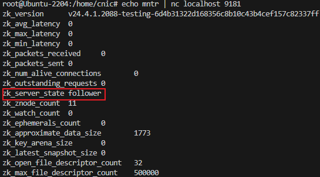

两台clickhouse-service做replicas 灾备，配置3台ClickHouse Keeper
官方文档：https://clickhouse.com/docs/en/architecture/replication#description

示例的集群节点如下：
clickhouse-service：
1：223.193.36.157
2：223.193.36.52
clickhouse-keeper：
1：223.193.36.224
2：223.193.36.225
3：223.193.36.226

tips：clickhouse-service和clickhouse-keeper不能装在同一机器上

#### 安装
官方文档：https://clickhouse.com/docs/en/install

1. 添加repository
```
sudo apt-get install -y apt-transport-https ca-certificates curl gnupg
curl -fsSL 'https://packages.clickhouse.com/rpm/lts/repodata/repomd.xml.key' | sudo gpg --dearmor -o /usr/share/keyrings/clickhouse-keyring.gpg

echo "deb [signed-by=/usr/share/keyrings/clickhouse-keyring.gpg] https://packages.clickhouse.com/deb stable main" | sudo tee \
    /etc/apt/sources.list.d/clickhouse.list
sudo apt-get update
```
2. 对于clickhouse服务节点，安装server and client
```
apt-get install -y clickhouse-server clickhouse-client
service clickhouse-server start
```
3. 对于clickhouse-keeper节点，安装clickhouse-keeper
```
sudo apt-get install -y clickhouse-keeper
sudo systemctl enable clickhouse-keeper
sudo systemctl start clickhouse-keeper
sudo systemctl status clickhouse-keeper
```
clickhouse-keeper服务启动失败，查看错误日志/var/log/clickhouse-keeper/clickhouse-keeper.err.log：
Code: 1001, type: std::__1::__fs::filesystem::filesystem_error, e.what() = filesystem error: in create_directories: Permission denied ["/var/lib/clickhouse-keeper"]
解决办法手动为clickhouse-keeper创建目录：
```
mkdir /var/lib/clickhouse-keeper /var/lib/clickhouse-keeper/preprocessed_configs
```

#### 配置
##### 1. clickhouse-service节点配置
所有service节点都需要执行下面操作

1. 配置外网访问和集群间访问
`vim /etc/clickhouse-server/config.xml`

修改其中的listen_host和interserver_http_host
```
<listen_host>::</listen_host> <!-- 允许所有外部访问 -->
<interserver_http_host>223.193.36.157</interserver_http_host> <!-- 以223.193.36.157节点为例，修改为自己的ip -->
```

2. 集群的replica配置
创建配置文件
`vim /etc/clickhouse-server/config.d/replication.xml`
以223.193.36.157上的clickhouse-service为例子，的填写的内容为（已标注需要修改的地方）：
```xml
<clickhouse>
    <logger>
        <level>debug</level>
        <log>/var/log/clickhouse-server/clickhouse-server.log</log>
        <errorlog>/var/log/clickhouse-server/clickhouse-server.err.log</errorlog>
        <size>1000M</size>
        <count>3</count>
    </logger>
    <display_name>cluster_1S_2R node 1</display_name><!-- replica的节点名 -->
    <listen_host>0.0.0.0</listen_host>
    <http_port>8123</http_port>
    <tcp_port>9000</tcp_port>
    <macros>
        <shard>01</shard>
        <replica>01</replica><!-- replica的编号，223.193.36.52机器上填写02 -->
        <cluster>cluster_1S_2R</cluster>
    </macros>
    <remote_servers replace="true">
        <cluster_1S_2R>
            <secret>mysecretphrase</secret>
            <shard>
                <internal_replication>true</internal_replication>
                <replica>
                    <host>223.193.36.157</host><!-- 根据实际的replica进行替换 -->
                    <port>9000</port>
                </replica>
                <replica>
                    <host>223.193.36.52</host><!-- 根据实际的replica进行替换 -->
                    <port>9000</port>
                </replica>
            </shard>
        </cluster_1S_2R>
    </remote_servers>
    <zookeeper>
        <node>
            <host>223.193.36.225</host><!-- 根据实际的clickhouse-keeper进行替换 -->
            <port>9181</port>
        </node>
        <node>
            <host>223.193.36.226</host><!-- 根据实际的clickhouse-keeper进行替换 -->
            <port>9181</port>
        </node>
        <node>
            <host>223.193.36.227</host><!-- 根据实际的clickhouse-keeper进行替换 -->
            <port>9181</port>
        </node>
    </zookeeper>
</clickhouse>
```

3. 重启生效服务
重启服务以生效配置
`service clickhouse-server restart`
检查服务状态
`service clickhouse-server status`
进入client
`clickhouse client`


##### 2. clickhouse-keeper节点配置
所有keeper节点都需要执行下面操作

1. 集群配置
替换keeper配置文件
`vim /etc/clickhouse-keeper/keeper_config.xml`
以223.193.36.224上的clickhouse-keeper为例子，的填写的内容为（已标注需要修改的地方）：
```xml
<clickhouse>
    <logger>
        <level>trace</level>
        <log>/var/log/clickhouse-keeper/clickhouse-keeper.log</log>
        <errorlog>/var/log/clickhouse-keeper/clickhouse-keeper.err.log</errorlog>
        <size>1000M</size>
        <count>3</count>
    </logger>
    <listen_host>0.0.0.0</listen_host>
    <keeper_server>
        <tcp_port>9181</tcp_port>
        <server_id>1</server_id><!-- 不同的keeper填写不同的编号 -->
        <log_storage_path>/var/lib/clickhouse/coordination/log</log_storage_path>
        <snapshot_storage_path>/var/lib/clickhouse/coordination/snapshots</snapshot_storage_path>
        <coordination_settings>
            <operation_timeout_ms>10000</operation_timeout_ms>
            <session_timeout_ms>30000</session_timeout_ms>
            <raft_logs_level>trace</raft_logs_level>
        </coordination_settings>
        <raft_configuration>
            <server>
                <id>1</id>
                <hostname>223.193.36.225</hostname><!-- 根据实际的clickhouse-keeper进行替换 -->
                <port>9234</port>
            </server>
            <server>
                <id>2</id>
                <hostname>223.193.36.226</hostname><!-- 根据实际的clickhouse-keeper进行替换 -->
                <port>9234</port>
            </server>
            <server>
                <id>3</id>
                <hostname>223.193.36.227</hostname><!-- 根据实际的clickhouse-keeper进行替换 -->
                <port>9234</port>
            </server>
        </raft_configuration>
    </keeper_server>
</clickhouse>
```
3. 重启生效服务
重启服务以生效配置
`systemctl restart clickhouse-keeper`
检查服务状态
`systemctl status clickhouse-keeper`
测试keeper运行状态
执行在keeper节点上shell执行`echo mntr | nc localhost 9181`
leader的响应：

follower的响应：

